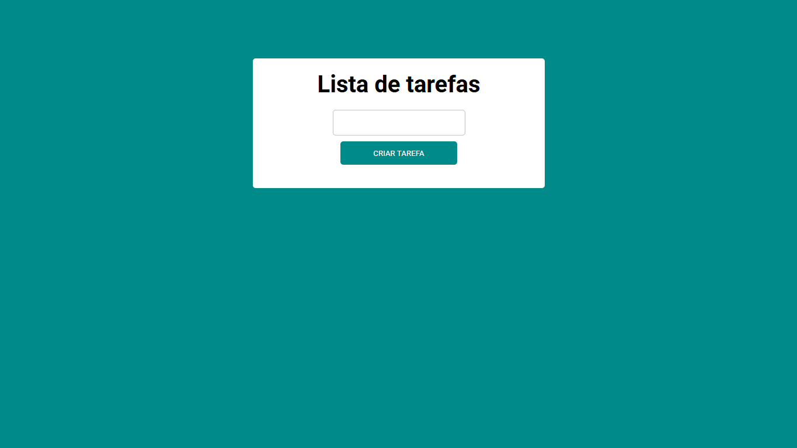

# lista-de-tarefas
Uma simples lista de tarefas com JavaScript

## Aprendizado
- localstorage
- JSON.stringfy
- JSON.parse

## Screenshot

## Link do site

URL: [Lista de tarefas](https://matheusrenner22.github.io/lista-de-tarefas/)